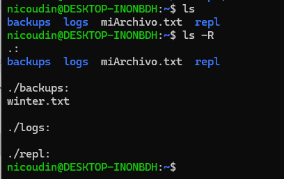
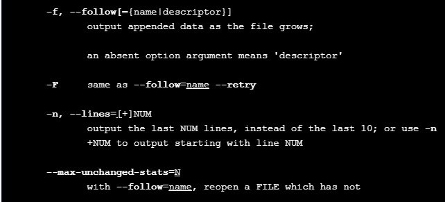
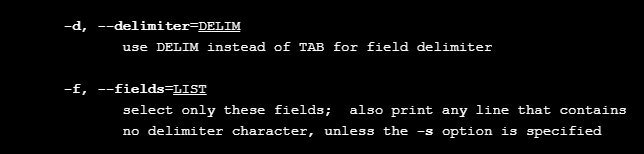

# Introduction to Shell

Indice

1. [Manipulating Files and Directories]()
    - [pwd]()
    - [list files]()
        - [Rucursive]()
    - [Relative path vs Abssolute path]()
    - [Change directory - CD]()
    - [Copiar archivos]()
    - [Mover un archivo]()
    - [Delete files]()
    - [history]()
2. [Manipulating Data]()
    - [File content]()
    - [Head y tail]()
    - [Como usar la ayuda MAN]()
    - [Selecionar columnas]()
    - [Buscar patrones con grep]()
3. [Combinando herramientas]()   
    - [Como grabar la salida de un comando]()
    - [Como combinar comandos]()
    - [Contar registros en un archivo]()
    - [Trabajar con varios archivos de forma simultanea]()
    - [Sort records]()
    - [Remover duplicados]()
4. [Batch Processing]()
    - [Como se almacena la informacion]()
    - [Loops in Bash]()


## 1. Manipulating Files and Directories.

Para poder trabajar con Shell es importante saber en donde estamos.
Para eso usamos PWD (Print Working Directory) que como resultado nos muestra el __path absotulo_ de nuestra ubicación.

```
/home/usr/repl
```

### List files in a directory

Existen varias formas de listar el contenido de un directorio.

```shell
ls # Si estamos posicionados en el directorio
```

```shell
ls /home/usr/ #Si queremos ver el contenido desde otro directorio
```

Tambien podemos listar todo el contenido de un directorio includo de sus sub-directorios usando el flag -R

```shell
ls -R
```



Esto nos muestra el directorio actual y el contenido de todos sus sub-directorios

Si al comando anterior le agregamos __-F__ nos muestra una __/__ al final de cada directorio.

### Relative Path vs Absolute path.

Un path absoluto tiene el mismo significado desde cualquier directorio. Es el path que __empieza en el root__ hasta donde estamos ubicados.

En cambio el path relativo indica la locación desde donde eestamos ubicados.

Por ejemplo, si estamos en el directorio /home/usr y dentro de este hay un directorio seasonal entonces:

```
el path relativo seasonal indica lo mismo que el path absoluto home/usr/seasonal
```

__Shell decide si un path es absoluto o no viendo el primer caracter. Si empieza con / es absoluto caso contrario es relativo.__


Vemos la estructura de nuestro directorios para ahcer los ejemplos.


```
Desde /home/nicoudin/ podemos ver el contenido de Seassons haciendo
```

```shell
ls Seassons
```
### Change directory - CD

Para cambiar de directorio usamos el comando CD.
Este comando tiene varias consideraciones.

1. cd .. no lleva al directorio padre.
Si estamos en /home/nicoudin/Seassons nos lleva a /home/nicoudin/

```
hay que tener en cuenta que . significa en el directorio actual, .. significa en el directorio mas arriba. Tambien sirve la ls
```

2. Podemos ir a un directorio escribiendo tanto su path relativo como absoluto

```shell
cd Seassons
cd /home/nicoudin/Seassons
```

Estos dos comandos tendrán el mismo efecto.


3. ~ es un caracter especial que simepre nos lleva al direcrorio home que contene al path donde estamos ubicados. Por ejemplo si estamos en /home/nicoudin/Seassons hacer cd ~ no lleva a nuestro home que es __/nicoudin__ este siempre será nuestro home.

Por ejemplo si hacemos desde /home/nicoudin/Seassons    

```shell
cd ~/../. # Quiere decir: vamos al home (~) y luego un nivel mas arriba(..) y quedate aca (.) -> Resultado /root
```

### Copiar archivos

Para copiar archivos usamos el comando cp --copy

Para copiar uno o mas archivos a un directorio path hacemos:

```shell
cp path/file1 path/file2 pathfinal
```

Si queremos copiar un archivo y cambiarle el nombre hacemos:

```shell
cp path/file pathdest/file
```

__Esto le cambia el nombre al copiarlo, pero si existe un archivo con el mismo nombre lo sobrescribe__

```shell
cp Seassons/summer.txt Seassons/spring.txt /backup
```

Copiamos los archivos summer y spring de Seassons al directorio Backup.

```shell
cp Seassons/winter.txt /backup/winter.bcp
```

En este ejemplo se copia el archivo winter.txt y se le cambia el nombre por winter.bcp


### Mover uno o varios archivos

Funciona de la misma forma forma que __cp__ pero en lugar de copiar, mueve un archivo. __Tambien se puede usar para renombrar un archivo o un directorio__

Ejemplo:

```shell
mv summer.txt winter.txt ..
```

Este caso mueve dos archivos un nivel mas arriba. _Pero, un nivel más arriba de donde?__ desde donde estemoa ejecutando el comando __mv__ no desde donde están localizados los archivos.


```shell
mv Seassonal/sumer.txt Seassonal/spring backup
```

Movemos a la carpeta backup

__Ejemplo para renombrar un archivo__

```shell
mv summer.txt sumer_aux.txt
```

### Deleteing files

__IMPORTANTE__ una vez que eliminamos un archivo no se puede recuperar.
Para eliminar archivos hacemos:

```shell
rm file1 path/file2
```

Si queremos eliminar un directorio usando __rm__ no podemos. Shell nos da una advertencia indicnato que es un directorio.
Para eiliminar directorios usamos el comando __rmdir__ peor solo funciona si el directorio está vacio.

```shell
rmdir directorio
```

Ejemplo

```shell
rmdir Seassons
```

Existe otra forma para eliminar un directorio que no está vacio. Usando el comando __rm -r directorio__ Primero lo vacia y luego lo elimina.

### History de ejecucion

Si queremos ver que comandos fueron os que se ejecutaron en shell podemos usar __history__ que nos muestra en orden.
Si hacemos !head o !55 vuelve a ejecutar el último caso de uso de head o el último comando 55.

## 2. Manipulating Files.

### Como ver el conytenido de un archivo

La forma más rápida de ver un archivo es usando __cat__. Esto nos muestra el contenido del archivo en la consola.

```shell
cat file.csv
```

Si el contenido de un archivo es muy grande podemos usar __less__ para ver una parte de los datos.

```shell
less file1 file2
```

En este ejemplo vamos a evr el contenido de dos archivos, primero uno y luego el otro. Para avanzar hacemos :n y para salir :q

### Head y tail

Cuando trabajamos con un nuevo archivo lo más común es ver las primeras lineas del contenido del mismo. __El comando HEAD muestra las primera 10 lineas__ y __TAIL las últimas 10__

```shell
head file
```

Tambien podemos controlar la cantidad de registros que vemos usando banderas como __-n 3__ En este caso solo se mostrarian los primero tres registros

```shell
head -n 3 summer.txt
```

__IMPORTANTE__ El nombre de una flag generalmente indica su proposito. n siginfica __number of__.
Ene ste paso si usamos -n tambine sirve para indicar el numero de regsitro.


### Como usar la ayuda MAN

Man es un comando que nos ayudar a ver que opciones disponibles tiene cada comando.

Por ejemplo: __Read the manual page for the tail command to find out what putting a + sign in front of the number used with the -n flag does. (Remember to press spacebar to page down and/or type q to quit.)__

```shell
man tail
```



### Seleccionar columnas de un file

Así como HEAD y TAIL parmiten seleccionar ROWS hay una flag que nos permite seleccionar columnas.

Para seleccionar columnas usamos __CUT__

```shell
man cut
```



Generalemnte la flag -f se usa junto -d que indica el tipo de separador para que shell sepa donde empiza y termina una columna.

```text
nombre,apellido,edad, nacionalidad, nacimiento
nciolas,leali,37,Argentino,1988
patricio,parez,39, Argentino, 1986
alejandro,francolino,36, Argentino, 1988
martin,caronte,36, Argentino, 1988
```

En este ejemplo queremos leer del archivo winter.txt de la segunda a la tercer columna y la 5 (-f 2-4,5). El archivo está separado por , (-d ,)

```shell
cut -f 2-5,8 -d , winter.txt
```

__El orden de -f y -d es indistinto__

### Buscar patrones con grep

__grep__ funciona como un where. Ayuda a seleccionar en base a patrones.

```
head and tail select rows, cut selects columns, and grep selects lines according to what they contain
```

POr ejemplo:

Buscamos los registros que empiecen con __patr__ en el documento __winter.txt__

```shell
grep patr winter.txt
```

Opciones de grep
----------------

|flag|descripcion|
|----|-----------|
|-c |print a count of matching lines rather than the lines themselves|
|-h |do not print the names of files when searching multiple files|
|-i |ignore case (e.g., treat "Regression" and "regression" as matches)|
|-l |print the names of files that contain matches, not the matches|
|-n |print line numbers for matching lines|
|-v |invert the match, i.e., only show lines that don't match|

Ejemplo:

```
Mostrar los regsitros que no tengas 1988 en año y mostrar el numero de linea
```

```shell
grep -n -v 1988 winter.txt
```

__-n sin numero muestra el numero de lineas__

Si tenemos dos o mas archivos los podemos combinar para usar algunas operaciones. Por ejemplo

```shell
grep -c 1988 winter.txt spring.txt
```

El resultado será un totalizador por archivo con la cantidad de reistros que cumplen con la condición.

## 3. Combinando herramientas

### Cómo grabar la salida de un comando

La mayoria de comandos no tienen una opción para generar un archivo de salida. Pero podemos redireccionar el resultado usando __> file__

```shell
tail -n 5 miFile > miSalida.txt
```

Este ejemplo graba los ultimos 5 resgistros en un archivo miSalida.txt

El redireccionador no es necesario que esté al final, puede estar al inicio.

```shell
report.txt > head -n 4 winter.txt
```

### Como combinar comandos

Para combinar comandos pordemos generar archvios intermedios aplciando primero unos y sobre el resultado del archivo los otros.
Esto tiene una dificultad que es que se generan muchos archivos intermedios y lineas de codigo en elShell.

- Una solucion mejor es usar __|__ (pipe)

```shell
head -n 5 file1 | tail -n 3
```

The pipe symbol tells the shell to use the output of the command on the left as the input to the command on the right.

Vamos a seleccionar del archivo winter.txt todos los apellidos y luego vamos a eliminar del resultado el nombre de la columna.

```
cut -f 2 -d , winter.txt | grep -v apellido | cat -n
```

Primero seleccionamos la columna 2 separada por ,.
Y al resultado le aplicamos buscar la coincidenecia "apellido" pero invertida.
Y por ultimo le agregamos el numero de rows.


### Contar registros en un archivo

En shell tenemos el comando __wc__ Word Counts. 
Se usa con las flags __-f -w -l__


```shell
grep 1988 winter.txt | wc -l # -l significa contar cantidad de lineas
```

Esto devuelve 3.

### Trabajar con varios archivos de forma simultanea.

La mayoria de los comandos de Shell se puden usar con mas de un archivo por ejemplo:

```shell
cut -d , -f 1 winter.txt summer.txt
```

Pero si tenemos muchos archvios es dificil de leer. __Para solucionar esto podemos usar WILDCARDS__

|wildcard|Uso|
|--------|---|
|*|Match zero or more characters|
|?| matches a single character, so 201?.txt will match 2017.txt or 2018.txt, but not 2017-01.txt.
|[...]| matches any one of the characters inside the square brackets, so 201[78].txt matches 2017.txt or 2018.txt, but not 2016.txt.
|{...}| matches any of the comma-separated patterns inside the curly brackets, so {*.txt, *.csv} matches any file whose name ends with .txt or .csv, but not files whose names end with .pdf.

```shell
cut -d , -f 1 win* # "Busca todo lo que empiece por win
cut -d , -f 1 path/*.csv  # Busca todos los files en path que terminan en .csv
```

### Ordenar registros de salida.

Para ordenar los registros podemos usar __sort__ con las banderas -n  y -r para ordenar de forma descendente o ascendente.
__Por defecto el ordenamiento es en orden ascendente__


### remove duplicates

Para remover duplicados los regsitros deben estar ordenados.
EL comando q ue se usa es __uniq__ y generalmente se usa junto a __sort__ ya que remueve resgirtios iguales adyacentes.

Para ver los años únicos en el archivo winter.txt hacemos

```shell
cut -d , -f 5 winter.txt | grep -v nacimiento | sort -r | uniq
```

devuelve 1986 y 1988

Tambien podemos contar la cantidad de ocurrencias usando __uniq__

```shell
cut -d , -f 5 winter.txt | grep -v nacimiento | sort -r | uniq -c
```

Es como hacer un GroupBy

## 4. Bash processing

### Como se almacena la informacion

Shell alamacena la información en variables, las mas comunes son:


|Variable|	Purpose|	Value|
|--------|---------|---------|
|HOME	|User's home directory	|/home/repl
|PWD	|Present working directory	Same as pwd |command|
|SHELL	|Which shell program is being used	|/bin/bash
|USER	|User's ID	|repl

Las variables se guardan en el __set__ si lo vemos es un archivo con codigo, pero podemos buscar las variables en el. __Algunas variables se llaman variables de entorno__

```shell
set | grep HISTFILESIZE
```

Esto nos trae el valor de la variable en Entorno HISTFILESIZE

PAra buscar los valores de las variables tambien podemos usar __echo $VARIABLE__

```shell
echo $USER
echo $OSTYPE
```

Los otros tipos de variables son las __variables locales__

Son variables volatiles que usamos para desarrollar y que podemos usar en cualquier parte del codigo. __por convención se escriben en minuscula__

```shell
miVariable=path/miarchivo.csv
head -n 1 miVariable
```

En este ejemplo creamos una variable con un path y su archivo y luego le aplicamos el comando HEAD para obtener el primer registro.

Tambien podemos guardar listas en variables.

```shell
filenames=backups/*.txt
echo $filenames
```

Esto lo que hace es guardar todos los nombres de archivos en una variable, haciendo que si queremos hacer un loop no tengamos que escribir todo el comando o la lista en la definición.


### Loops in Bash

Para crear bucles en Bash usamos la siguiente estructura

```shell
for variable in 1 2 3 4 ;
do
    echo $variable;
done    
```

Tambien podemos usasar comandos o __WILDCARDS__ para crear las listas sobre las que queremos iterar.

```shell
for listfiles in backups/*.txt; 
do
    echo $listfiles;
done
```

Iterando sobre listas en variables, el resultado es igual al anterior pero en menos propenso a errores.

```shell
filenames=backups/*.txt
for mifile in $filenames; 
do
    echo $mifile;
done
```

Vamos a hacer un caso práctico de Loops usando comandos para analizar datos.

Queremos obetenr todos los registrtos de los nacidos en 1988 ordenados.

```shell
files=backups/*.txt
for filename in $files;
do  
    cut -d , -f1-5 $filename | grep 1988 | sort
done
```

Tambien podemos ejecutar varios comando en un Loop separando por ,


Queremos ver por cada archivo el último registro.


```shell
files=backups/*.txt
for filename in $files;
do
    echo $filename;
    tail -n 1 $filename;
done    
```